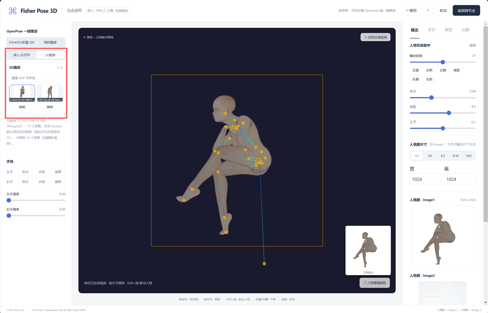

# ComfyUI-Fisher-Pose-3D

在原版 Fisher Pose 基础上增加 DAZ DUF 姿势导入及持久化 3D 图库。

**2026-09-30：自由姿势支持5个角色和5路人物参考图。** 左侧顶部管理角色，蓝色高亮当前选择；DUF导入应用选中角色，应用到节点保存完整场景。查看[五角色使用方法、资料来源与限制](docs/five-characters.md)。多人生成绑定为实验性功能，单人旧工作流继续使用。

## 来源、改动与声明

本项目是基于 [Work-Fisher/ComfyUI-Fisher-Pose](https://github.com/Work-Fisher/ComfyUI-Fisher-Pose) 的独立衍生版本，不是原作者的官方发布，也不与原作者、MiuProject、AHEKOT、MakeHuman、Qwen 或 three.js 作者存在隶属关系。

本版本保留上游 MIT 许可和第三方许可证，并在此基础上新增或调整：

- 独立的 `Fisher3D*` 节点 ID、前端扩展名、HTTP 路由、缓存和图库目录，使其可与原版同时安装。
- DAZ Studio `.duf` 姿势导入、Genesis 3 / 8 / 8.1 / 9 及传统 DAZ 骨骼近似重定向、缩略图和持久化 3D 图库。
- 三图库互斥切换、文件选择器稳定性、3D 节点命名和来源徽标。

完整变更记录见 [CHANGELOG-3D.md](CHANGELOG-3D.md)。使用第三方模型、LoRA、角色资产及姿势资产时，仍须遵守各自的许可和使用条款；本仓库不包含任何商业 DAZ 角色或姿势文件。

## 安装与使用

1. 将压缩包里的 `ComfyUI-Fisher-Pose-3D` 文件夹放入 `ComfyUI/custom_nodes/`。
2. 可与原版 `ComfyUI-Fisher-Pose` 同时安装。升级时覆盖 3D 版文件夹即可，原版保持原样。
3. 重启 ComfyUI，浏览器 Ctrl+F5 强制刷新。节点菜单选择「Fisher P3D / 姿态与机位」→「Fisher Qwen2.1 自由姿势（3D）」。
4. 左侧原图库切换栏下点击「导入3D文件」，选择一个或多个 `.duf`。导入后自动应用、调整画框、生成缩略图并保存。
5. 「3D图库」支持搜索、点击缩略图应用、逐项删除。数据保存在 `ComfyUI/input/fisher_pose_3d/`，包含原文件副本、解析姿势及缩略图；重启/更换浏览器后仍可用。
6. 调整后点击「应用到节点」，沿用原插件的预览与工作流输出。

## 两个版本的区分（界面修复版）

| 项目 | 原版 | 3D 版 |
| --- | --- | --- |
| 插件目录 | `custom_nodes/ComfyUI-Fisher-Pose` | `custom_nodes/ComfyUI-Fisher-Pose-3D` |
| 来源徽标 | `Fisher-Pose` | `Fisher-Pose-3D` |
| 节点分类 | `Fisher` | `Fisher P3D` |
| 节点 ID | `FisherPoseStudio`、`FisherQwenPose`、`FisherQwenFreePose`、`FisherQwen21GGUFCLIP` | `Fisher3DPoseStudio`、`Fisher3DQwenPose`、`Fisher3DQwenFreePose`、`Fisher3DQwen21GGUFCLIP` |
| 前端注册名 | `Fisher.PoseStudio` | `Fisher3D.PoseStudio` |
| HTTP 接口 | `/fisher_pose/*` | `/fisher_pose_3d/*` |
| OpenPose 我的图库 | `input/fisher_openpose/` | `input/fisher_pose_3d/openpose/` |
| DUF 图库 | 无 | `input/fisher_pose_3d/*.json`（保留上一版位置） |
| 节点预览缓存 | `temp/fisher_freepose_*.png` | `temp/fisher_pose_3d/fisher_3d_freepose_*.png` |
| 独立编辑器浏览器缓存 | `fisher-pose-multi-v2` | `fisher-pose-3d-multi-v2` |

所有 3D 节点显示名称以「（3D）」结尾；自由姿势节点保留「打开自由姿势编辑器」按钮。来源徽标由插件目录决定，请保持目录名为 `ComfyUI-Fisher-Pose-3D`，不要改名成原版目录。

两版也使用独立的编辑器消息、文件选择回调及提示词缓存。各自的清空/删除操作只作用于本版图库。

**工作流：**旧工作流仍指向原版节点，不会被 3D 版接管。3D 版自带 `workflows/` 已改用新节点 ID。若要把旧工作流切到 3D 版，可用下面的工具生成副本（连线、参数和已保存姿势保留）：

```text
python tools/convert_workflow_3d.py 原工作流.json 另存的3D工作流.json
```

第一版 3D 插件曾使用原版 ID，因此其旧工作流同样需要转换。转换工具不覆盖已有文件，也不改动输入文件。之前共享的 OpenPose 图库继续留给原版；需要用于 3D 版的图片可重新选择导入。DUF 历史无需迁移。

## DUF 支持范围

导入按钮与 3D 图库采用与上方一致的分段控件样式；选择 3D 图库时替换下方 OpenPose 图库，点上方分类可切换回来。取消文件选择不会关闭姿势编辑器。

本次包含 Python 后端修正，覆盖安装后需重启 ComfyUI，再 Ctrl+F5 强制刷新。

- 支持 JSON 与 gzip 压缩 DUF；每文件及解压后各限 16MB；支持多选，内容相同的文件自动去重。
- 支持 Genesis 3、8、8.1、9 的标准人体 DUF 骨骼命名，并保留传统 DAZ / Genesis 1、2 命名兼容；合并 bend/twist、胸腹、颈部及手掌链，映射身体和手指。姿势是可编辑的真实三维骨骼旋转。
- 多帧文件取离时间 0 最近的关键帧。多人预设请先在 DAZ 另存单人姿势。
- 纯姿势预设通常不含源骨骼定义：采用默认旋转顺序和初始姿态近似重定向；不同 Genesis 版本、体型、关节方向和手指可能需要微调，不能保证与 DAZ 逐关节完全一致。文件带 orientation/rotation_order 时优先使用。
- 不导入 DAZ 网格、材质、衣物、表情、形变、角色缩放及场景位移；保持现有人偶和自动居中。已用提供的 G8、G8.1、G9 样本完成导入、预览和缩略图验证。自定义骨架与仅有 ERC/Pose Controls、需要外部角色资产计算的预设不能保证完整还原。
- 转换依据 [DAZ DSON 节点变换规范](https://docs.daz3d.com/public/dson_spec/object_definitions/node/start)。

---

以下为上游插件文档（原版下载链接仅用于溯源）：

https://github.com/user-attachments/assets/24dc201a-d9dc-4ac7-86a8-acc9d8f6dd7c

<div align="center">

# ComfyUI-Fisher-Pose-3D

**给 Qwen Image 2.1 用的姿势与机位编辑插件：拖一拖 3D 人偶，或者点一张 OpenPose 骨架图，人物就摆成你要的样子。**

*A ComfyUI pose & camera studio for Qwen Image 2.1 — pose a 3D mannequin (or pick an OpenPose skeleton) and redraw your character in that pose.*


</div>

## 能做什么

| 模式 | 节点 | 一句话 |
|---|---|---|
| **自由姿势** | `Fisher Qwen2.1 自由姿势（3D）` | 1–5个独立3D角色，分别对应5路参考图；单人沿用VNCCS约定，多人生成绑定为实验性 |
| **自由视角** | `Fisher Qwen2.1 人物与姿态编码` | 1–3 人共用机位：转镜头、改站位与动作，中文编辑指令，可接 PE 扩写（[详细说明](docs/自由视角详细说明.md)） |

### 自由姿势亮点

- **真人比例人偶**：采用 [VNCCS Pose Studio](https://github.com/AHEKOT/ComfyUI_VNCCS_Utils) 的 MakeHuman 人偶，和 LoRA 训练时用的人偶一致，模型认得出。
- **OpenPose 一键摆姿**：点一张彩色骨架图就能摆好。2D 骨架没有前后信息，插件按骨长缩短量推算深度；估错时，躯干和四肢各段都能一键在前后之间翻转。
- **FISHER小彩蛋**：内置 209 张骨架图，涵盖站、坐、跪、蹲、躺、劈叉、悬空等姿势，打开就能点。
- **我的图库**：自己的骨架图选一次就会保存下来，下次打开自动载入。
- **自由视角编辑，正面输出**：拖空白处随意转视角、拖关节摆姿（手、脚、髋部可 IK）、Shift+拖动移动人物；输出固定为 VNCCS 的正面相机。
- **手势预设**：张开、并拢、握拳，外加握紧程度滑杆。
- **比例调整**：头部大小、脖子、肩宽、躯干、上臂、小臂、大腿、小腿都可以单独拉长或缩短，姿势保持不变。
- **两个尺寸互不影响**：人偶图尺寸在编辑器里设；输出尺寸由节点的 width/height 决定，可以直接接分辨率节点。
- **应用即预览**：点「应用到节点」后，人偶图立刻显示在节点上，不用先跑一遍工作流。

## 效果


<sub>示例人物图为 AI 生成。人偶图是 image1，人物图是 image2，提示词固定为 `Draw character from image2`。</sub>

## 编辑器


- **左侧**：FISHER小彩蛋 / 我的图库、深度修正、手势。
- **中间**：3D 视口。橙色框是输出画面，右下角小图是实际的正面输出。
- **右侧**：人物在画面中的大小、位置和转身，人偶图尺寸，关节微调，体型，头颈与四肢比例。

## 安装

```bash
cd ComfyUI/custom_nodes
git clone https://github.com/han-kinn/ComfyUI-Fisher-Pose-3D.git
```

装好后重启 ComfyUI 并刷新浏览器。插件不需要额外安装 Python 依赖，节点搜 `Fisher` 就能找到。

**自由姿势需要的模型：**

| 文件 | 放到 | 说明 |
|---|---|---|
| `qwen_image_2.1_*.safetensors` | `models/diffusion_models` | Qwen Image 2.1 主模型 |
| `qwen3vl_8b_*.safetensors` | `models/text_encoders` | 类型选 `qwen_image` |
| `qwen_image_2.1_vae_*.safetensors` | `models/vae` | |
| `VNCCS_QI2_PoseStudioV1.1.safetensors` | `models/loras` | **必需**，强度 1。下载：[MIUProject/VNCCS_PoseStudio_QI2.1](https://huggingface.co/MIUProject/VNCCS_PoseStudio_QI2.1) |

ComfyUI 需要是带 `TextEncodeQwenImage21` 节点的新版本。

## 快速上手（自由姿势）

1. 拖入 `workflows/Fisher-Qwen2.1-自由姿势-VNCCS-LoRA.json`，在「人物图 → image2」节点里选你的人物照片。
2. 点节点上的 **「打开自由姿势编辑器」**，在左侧 FISHER小彩蛋 里点一张骨架图，或者自己拖关节摆姿势。
3. 需要时用「深度修正」翻转前后、调整手势和人物大小，然后点 **「应用到节点」**。
4. 设置输出宽高，点运行。推荐参数：25 步、cfg 1、euler / simple，和 VNCCS 官方一致。

> `extra_prompt` 会另起一行附在固定指令后面，建议写英文，例如 `soft studio light`。

## 示例工作流：最强姿势自由编辑 3D

用户提供的工作流按原文件名保存在 [workflows/【Work-Fisher】26-9-26最强姿势自由编辑3D.json](workflows/%E3%80%90Work-Fisher%E3%80%9126-9-26%E6%9C%80%E5%BC%BA%E5%A7%BF%E5%8A%BF%E8%87%AA%E7%94%B1%E7%BC%96%E8%BE%913D.json)。它串联 Qwen Image 2.1、VNCCS PoseStudio LoRA、分辨率选择器、`Fisher Qwen2.1 自由姿势（3D）`、采样与保存节点。

`Fisher-Pose-3D-自由姿势示例.json` 保留首次提交的内容。用户反馈该示例存在问题，目前尚未定位；本次按原名上传的文件与该首次提交内容相同，仅验证了 JSON 可解析，尚未验证完整生成流程。

导入后，在「人物图 → image2」选择自己的参考图，确认所需模型和 LoRA 已安装，再点击 `Fisher Qwen2.1 自由姿势（3D）` 节点中的「打开自由姿势编辑器」。工作流不含用户图片、商业 DAZ 文件或本机绝对路径；原工作流中保存的图片名称仅作为 ComfyUI 的可替换占位引用。



截图展示了编辑器的「导入3D文件」和「3D图库」区域，以及导入后可以继续手动调整的人偶姿势。

## 致谢

这个插件的自由姿势模式建立在以下开源工作之上，感谢各位作者的付出：

- **[VNCCS Utils](https://github.com/AHEKOT/ComfyUI_VNCCS_Utils) · [MiuProject / AHEKOT](https://github.com/AHEKOT)**：提供了 Pose Studio 人偶核心（`PoseViewerCore`、IK、截图）、MakeHuman 人体包加载、手部预设，以及 **[VNCCS PoseStudio QI2.1 LoRA](https://huggingface.co/MIUProject/VNCCS_PoseStudio_QI2.1)** 和它的训练约定（人偶 = image1，人物 = image2，`Draw character from image2`）。如果没有这套人偶和 LoRA，就没有这个自由姿势模式。代码以 MIT 许可随本仓库分发于 `web/vnccs/`，改动说明见该目录的 README。欢迎去原仓库点个星。
- **[MakeHuman](http://www.makehumancommunity.org/)**：人体网格与形体数据（CC0 1.0）。
- **[Qwen Image 2.1](https://github.com/QwenLM/Qwen-Image-2.1)**：生图模型，以及 [prompt_rewrite](https://github.com/QwenLM/Qwen-Image-2.1/tree/main/prompt_rewrite) 编辑指令规范（用于自由视角模式）。
- **[three.js](https://threejs.org/)**：3D 渲染（MIT）。
- **[ControlNet](https://github.com/lllyasviel/ControlNet)**：OpenPose 骨架的配色与连接顺序参考。
- **[ComfyUI-qwenmultiangle](https://github.com/jtydhr88/ComfyUI-qwenmultiangle)**：视角分档与镜头词汇参考。
- **[ComfyUI](https://github.com/comfyanonymous/ComfyUI)**：插件运行的平台。

## 许可

- 本插件代码：[MIT](LICENSE)。
- `web/vnccs/`：VNCCS Utils（MIT, © 2025 MiuProject）；MakeHuman 人体包（CC0 1.0）；three.js（MIT）。
- `web/editor/vendor/`：three.js（MIT）。
- 使用 LoRA 和基础模型时，请遵守它们各自的许可。

## 已知限制

- 自由姿势支持最多5个角色。每次 OpenPose 导入只取图中身形最大的人并应用当前选中角色；多个DUF文件可依次导入不同角色。
- 2D 骨架无法唯一确定前后深度，复杂姿势需要手动翻转或微调。头部朝向、手指、脚掌不会从骨架读取。
- 人偶图只提供姿势。输出比例和人偶图差别很大时，人物在画面里的位置由模型决定。
- DUF 导入只读取姿势旋转；不导入网格、材质、衣物、形变、表情和场景布局。未包含骨骼定义的预设采用默认骨架近似转换，复杂手指、关节方向、ERC / Pose Controls、自定义角色骨架和旧式非 DUF 文件无法保证逐关节还原。

---

更多：[自由视角模式详细说明](docs/自由视角详细说明.md)
