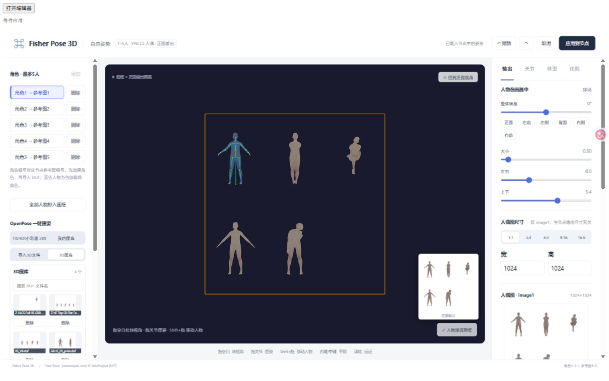

# 五角色与参考图（2026-09-30）

自由姿势（3D）节点现在支持最多 5 个同场景角色。更新后重启 ComfyUI，并 Ctrl+F5 刷新；旧节点若未显示新增接口，请重新添加该节点再连接。

## 使用方法

1. 将人物图接到 `reference_image`（角色1）、`reference_image_2`…`reference_image_5`。各接口接受一张图片，不能接图片批次。只需要连接场景中存在的角色。
2. 打开自由姿势编辑器，在左侧顶部添加、选择、删除角色。至少保留一个角色。编号固定，删除角色2不会把角色3改成角色2；添加时优先复用空编号。
3. 选中角色后，其模型呈蓝色并显示关节。导入单个 DUF 或点击3D图库只应用到当前角色。批量导入时，首个文件应用当前角色，其余文件新增角色；超出剩余槽位会提示。
4. 各角色可单独修改姿势、体型、比例、位置及大小。相机和输出图尺寸共用。“全部人物排入画框”会重新排列所有角色；可再调整位置。
5. 点击右上角“应用到节点”关闭编辑器，保存全部角色和合成人偶图。重新打开会恢复角色、姿势和当前选择。蓝色选中高亮不会进入人偶输出。

多人姿势图带数字编号，后端把这些编号与人物参考图绑定。编码顺序为合成人偶图、按角色编号排序的已用人物图，总计最多6张。空角色不占图像位置，提示词同步调整对应的 image 编号。模型生成时会被要求移除数字。

## 资料与来源

- [QwenLM/Qwen-Image-2.1](https://github.com/QwenLM/Qwen-Image-2.1)：官方说明最多10张参考图，支持多主体组合。本插件使用已有的 ComfyUI `TextEncodeQwenImage21` 编码器，无需额外安装参考图插件。
- [Qwen 官方多图提示词规则](https://github.com/QwenLM/Qwen-Image-2.1/blob/main/prompt_rewrite/prompts/system_prompt_edit.txt)：多人模式使用 `<image1>` 等明确标识各图用途。
- [AHEKOT / VNCCS Pose Studio 使用说明](https://github.com/AHEKOT/ComfyUI_VNCCS_Utils/blob/main/docs/VNCCS_POSE_STUDIO_USAGE.md)：参考其固定角色槽位和活动角色编辑方式；复用本项目已有的 MIT 授权 VNCCS 人偶内核及被动角色克隆接口，增加本插件的5角色管理与DUF分配。
- [MIUProject 的 QI2.1 LoRA 仓库](https://huggingface.co/MIUProject/VNCCS_PoseStudio_QI2.1)：访问时没有模型卡，不能据此保证该 LoRA 针对5人绑定训练过。单角色1仍沿用 Work-Fisher 的 `Draw character from image2` 约定。
- 原插件作者为 [Work-Fisher](https://github.com/Work-Fisher/ComfyUI-Fisher-Pose)。本次新增接口、状态保存和参考图绑定由此3D分支实现；原许可证及第三方声明保持保留。

## 已知限制

验证：46项 Python 测试、17项前端测试通过；浏览器验证5角色添加上限、4个DUF样本批量导入、单角色图库应用、删除后编号保留/复用、场景保存关闭及重新打开。参考图编码测试覆盖5人及空槽位顺序，使用测试CLIP/VAE而非真实权重。

- 多人编辑与数据对应是确定性的；扩散生成中的身份一致性、遮挡和姿势还原仍取决于模型，属于实验性能力，尚未进行完整5人GPU生成质量验证。
- 多人图的数字可能偶尔出现在最终生成中，重叠角色可能发生身份混淆，建议避免头部和编号完全重叠。
- DUF 导入的是姿势，不是 DAZ 人物网格、服装、材质或变形器；不同代际骨架采用近似转移，原有脸部/眼睛等未映射限制仍存在。
- 添加角色会自动排列场景；删除角色不会自动移动其他角色。单角色撑满按钮只调整当前角色。
- 人物参考图保留在 ComfyUI 连接上，编辑器只显示预览。图库保存单个DUF条目，完整多人场景保存在节点的 `pose_json` 和工作流中。
